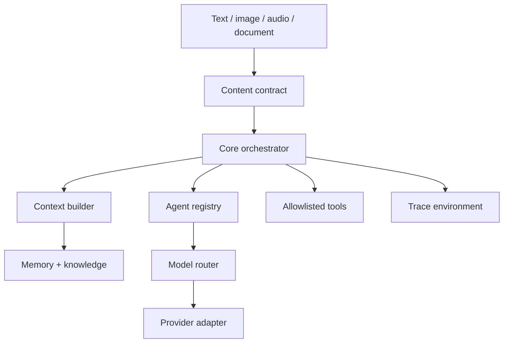

# Architecture

The public model contract is in `contracts.py` and `model.py`. The MiniMax
protocol is isolated in `providers/minimax.py`. Agents select capabilities such
as `reasoning` or `coding`; the model router maps capabilities to registry IDs.
No agent imports a MiniMax class.

`content.py` defines the provider-neutral `SPARKLE-CONTENT/1` envelope. Legacy
string messages remain strings and serialize exactly as before. Explicit
envelopes carry bounded text, image, audio, or document parts into the same
context, agent, routing, request, adapter, and trace path. Adapters declare
their supported modalities and validation fails closed before a provider call.
The MiniMax adapter remains text-only; a future adapter can add non-text
provider mapping without changing orchestration, agents, stores, or interfaces.
See `MULTIMODAL.md` for the exact contract and evidence boundary.

## Runtime composition

`SparkleSystem` constructs independent stores, registries, the context builder,
tool registry, orchestrator, voice service, presence engine, proactive engine,
automation store, notification store, static verifier, and opt-in fixed
workspace test runner.
Structured projects are owned by an independent store. Only a read-only search
tool is exposed to Personal, Project, and Productivity agents; create, update,
and archive remain explicit interface actions. The proactive engine consumes
validated project fields and emits content-free evidence rather than parsing
memory prose.
Structured skill mastery is also owned by an independent store. Its current
level is derived from verified evidence rather than accepted as input. Only
bounded content-free mastery summaries reach Personal, Learning, and Skill
agents; all writes remain explicit interface actions.
The agent-blueprint builder is a separate provider-neutral composition over the
agent registry. It deterministically converts exact structured requirements to
an `AgentSpec`, executes production routing fixtures without registry mutation,
and persists an approved blueprint separately from the installed manifest.
The response evaluator is composed only after the orchestrator exists. It
revalidates the installed blueprint and calls the common router through an
isolated orchestrator profile that disables context and tools. Its evidence
store receives hashes and check metadata, never raw prompts or responses.
The AI System Blueprint builder composes the model, agent, and tool registries
with the bounded workspace manager. Structured capability/modality
requirements resolve against enabled model records without constructing an
adapter. Approved builds materialize a canonical architecture manifest while
preserving the memory, knowledge, data, trace, provider, and secrets
boundaries. It does not call models, run evaluations, or deploy targets.
The AI System Draft compiler is composed only after the orchestrator exists.
With explicit approval it sends bounded natural-language requirements through
the existing model router using the isolated no-context/no-tool profile. Its
output must pass exact JSON parsing and the full Blueprint validator. A
separate evidence store receives only lengths, a digest, bounded execution
labels, trace linkage, status, and safe error type—not prompt or response text.
The AI System Implementation Planner is a separate deterministic composition
over the Blueprint builder and bounded workspace manager. It revalidates the
Blueprint, removes provider identities from plan inputs, derives confined
proposed source/evaluation paths and ordered review gates, and can materialize
only a canonical plan manifest after approval. Its independent evidence store
contains digests and bounded outcomes, not the plan or source. It does not call
a model, generate proposed files, execute tests, or deploy a target.
The AI System Source Candidate service consumes only a materialized and
explicitly reviewed plan. Provider/model disclosure is stored and approved in
a separate record before the isolated evaluation-profile model call. Exact
JSON output is confined to plan-declared paths under `candidate_environment`.
Generated, reviewed, statically verified, and approved are distinct monotonic
states. Static verification parses but never imports or executes candidate
source; approval does not copy it into an application or production tree.
The Candidate Runtime Evaluator is a separate operator boundary over approved
source-candidate evidence, evaluator-owned ephemeral bundles, and the existing
external-worker client. It validates a provider-neutral fixed-unittest contract
and candidate/plan identity, binds approved execution limits into the signed
request, persists a monotonic lifecycle, evaluates bounded result criteria,
and annotates a content-free trace. It never uses the local process executor,
promotes source, packages an artifact, or deploys. Signed sandbox fields remain
claims; only separately executed isolation can set verified isolation evidence.
An independent artifact manager reads bounded application workspaces and emits
deterministic content-addressed ZIPs; it never starts an executable.
The automation service is another independent entrypoint over the existing
automation runner. It adds a POSIX singleton lock, expiring claim tokens,
recovery/fencing, persisted lifecycle health, and signal-driven draining; it
does not duplicate orchestration or introduce command execution.
It also composes an operator-only external-worker client outside the model tool
registry. That client owns bounded source packaging, HTTPS/HMAC protocol
validation, and result persistence. The independently installable
`sparkle-worker` service implements the other side of the fixed protocol; it
has its own configuration, secret resolution, replay database, request
validator, and executor interface. The application never imports or starts the
worker service.
Interfaces call this object; they do not own intelligence.

The production executor builds one immutable Bubblewrap command with a
read-only runtime, a single writable ephemeral workspace, cleared environment,
all namespaces unshared, no network namespace interface, and the trusted
unittest runner. Readiness is false unless an executable preflight confirms the
host filesystem is hidden, the environment is allowlisted, and outbound
network connection fails. A separate process executor exists for loopback
protocol testing only and always reports filesystem/network isolation false.

The HTTP boundary composes an independent bearer access policy, bounded rate
limiter, secret-free audit store, and process-local browser-session manager.
Dashboard sessions wrap the API boundary only; agents, models, memory, tools,
and orchestration do not depend on cookie or browser implementation details.

## Storage boundaries

- `var/memory_environment/memory.sqlite3`
- `var/knowledge_environment/knowledge.sqlite3`
- `var/data_environment/automations.sqlite3`
- `var/data_environment/notifications.sqlite3`
- `var/data_environment/generated_agents.sqlite3`
- `var/data_environment/agent_blueprints.sqlite3`
- `var/data_environment/agent_evaluations.sqlite3`
- `var/data_environment/ai_system_blueprints.sqlite3`
- `var/data_environment/ai_system_drafts.sqlite3`
- `var/data_environment/ai_system_implementation_plans.sqlite3`
- `var/data_environment/source_provider_disclosures.sqlite3`
- `var/data_environment/source_candidates.sqlite3`
- `var/data_environment/runtime_evaluations.sqlite3`
- `var/candidate_environment/source_candidates/`
- `var/runtime_environment/evaluations/`
- `var/data_environment/projects.sqlite3`
- `var/data_environment/skills.sqlite3`
- `var/data_environment/automation-service.lock`
- `var/data_environment/builds.sqlite3`
- `var/data_environment/verifications.sqlite3`
- `var/data_environment/test_runs.sqlite3`
- `var/data_environment/external_worker_runs.sqlite3`
- `var/data_environment/artifacts.sqlite3`
- `var/data_environment/artifacts/`
- `var/trace_environment/api_audit.sqlite3`
- `var/trace_environment/traces.sqlite3`

The worker owns a separate deployment state root containing only its bounded
job replay database. It does not read the application memory, knowledge, trace,
provider, or secrets databases.

`var/` is excluded from Git and is the source-checkout default. Installed POSIX
packages use the user's XDG state directory. Override either with
`SPARKLE_DATA_DIR`.

## Tool loop

The orchestrator supplies only tools allowed by the selected agent. A model can
request a tool, the registry validates the allowlist, the result is returned as
a tool message, and the full provider response state is preserved for
interleaved thinking. The loop stops after the configured maximum.
