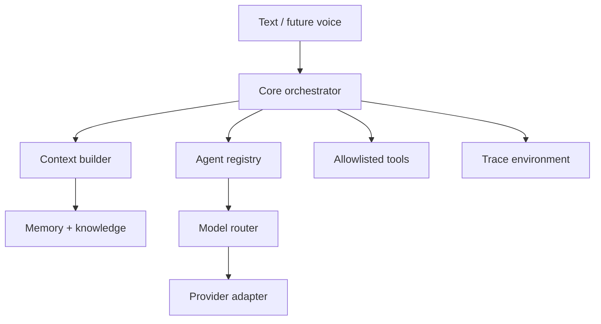

# Architecture

The public model contract is in `contracts.py` and `model.py`. The MiniMax
protocol is isolated in `providers/minimax.py`. Agents select capabilities such
as `reasoning` or `coding`; the model router maps capabilities to registry IDs.
No agent imports a MiniMax class.

## Runtime composition

`SparkleSystem` constructs independent stores, registries, the context builder,
tool registry, orchestrator, voice service, presence engine, proactive engine,
automation store, static verifier, and opt-in fixed workspace test runner.
Interfaces call this object; they do not own intelligence.

## Storage boundaries

- `var/memory_environment/memory.sqlite3`
- `var/knowledge_environment/knowledge.sqlite3`
- `var/data_environment/automations.sqlite3`
- `var/data_environment/builds.sqlite3`
- `var/data_environment/verifications.sqlite3`
- `var/data_environment/test_runs.sqlite3`
- `var/trace_environment/api_audit.sqlite3`
- `var/trace_environment/traces.sqlite3`

`var/` is excluded from Git. Override its parent with `SPARKLE_DATA_DIR`.

## Tool loop

The orchestrator supplies only tools allowed by the selected agent. A model can
request a tool, the registry validates the allowlist, the result is returned as
a tool message, and the full provider response state is preserved for
interleaved thinking. The loop stops after the configured maximum.
