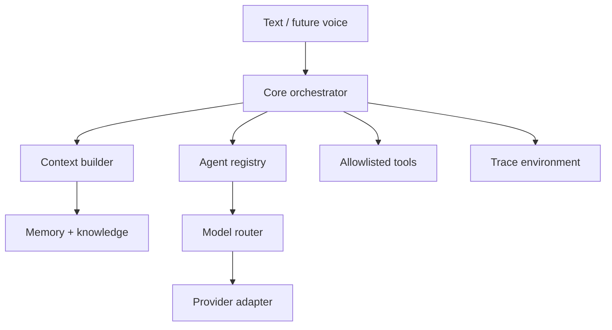

# Architecture

The public model contract is in `contracts.py` and `model.py`. The MiniMax
protocol is isolated in `providers/minimax.py`. Agents select capabilities such
as `reasoning` or `coding`; the model router maps capabilities to registry IDs.
No agent imports a MiniMax class.

## Runtime composition

`SparkleSystem` constructs independent stores, registries, the context builder,
tool registry, orchestrator, voice service, presence engine, proactive engine,
automation store, static verifier, and opt-in fixed workspace test runner.
An independent artifact manager reads bounded application workspaces and emits
deterministic content-addressed ZIPs; it never starts an executable.
It also composes an operator-only external-worker client outside the model tool
registry. That client owns bounded source packaging, HTTPS/HMAC protocol
validation, and result persistence. The independently installable
`sparkle-worker` service implements the other side of the fixed protocol; it
has its own configuration, secret resolution, replay database, request
validator, and executor interface. The application never imports or starts the
worker service.
Interfaces call this object; they do not own intelligence.

The production executor builds one immutable Bubblewrap command with a
read-only runtime, a single writable ephemeral workspace, cleared environment,
all namespaces unshared, no network namespace interface, and the trusted
unittest runner. Readiness is false unless an executable preflight confirms the
host filesystem is hidden, the environment is allowlisted, and outbound
network connection fails. A separate process executor exists for loopback
protocol testing only and always reports filesystem/network isolation false.

The HTTP boundary composes an independent bearer access policy, bounded rate
limiter, secret-free audit store, and process-local browser-session manager.
Dashboard sessions wrap the API boundary only; agents, models, memory, tools,
and orchestration do not depend on cookie or browser implementation details.

## Storage boundaries

- `var/memory_environment/memory.sqlite3`
- `var/knowledge_environment/knowledge.sqlite3`
- `var/data_environment/automations.sqlite3`
- `var/data_environment/builds.sqlite3`
- `var/data_environment/verifications.sqlite3`
- `var/data_environment/test_runs.sqlite3`
- `var/data_environment/external_worker_runs.sqlite3`
- `var/data_environment/artifacts.sqlite3`
- `var/data_environment/artifacts/`
- `var/trace_environment/api_audit.sqlite3`
- `var/trace_environment/traces.sqlite3`

The worker owns a separate deployment state root containing only its bounded
job replay database. It does not read the application memory, knowledge, trace,
provider, or secrets databases.

`var/` is excluded from Git. Override its parent with `SPARKLE_DATA_DIR`.

## Tool loop

The orchestrator supplies only tools allowed by the selected agent. A model can
request a tool, the registry validates the allowlist, the result is returned as
a tool message, and the full provider response state is preserved for
interleaved thinking. The loop stops after the configured maximum.
