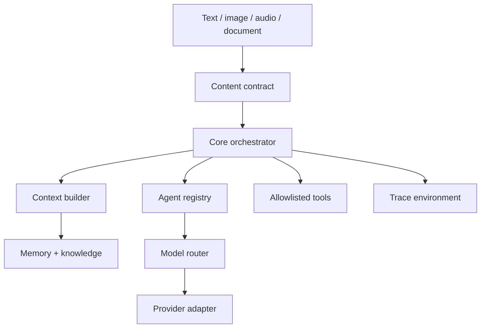

# Architecture

The public model contract is in `contracts.py` and `model.py`. NVIDIA NIM and
MiniMax protocols are isolated in `providers/nvidia.py` and
`providers/minimax.py`. Agents select capabilities such as `reasoning` or
`coding`; the request policy combines those requirements with modality, tools,
streaming, health, latency, timeout, availability, and explicit fallback rules.
No agent imports a provider class. `model_runtime.py` stores only content-free
health, routing, latency, retry, fallback, usage, and error evidence.

`content.py` defines the provider-neutral `SPARKLE-CONTENT/1` envelope. Legacy
string messages remain strings and serialize exactly as before. Explicit
envelopes carry bounded text, image, audio, or document parts into the same
context, agent, routing, request, adapter, and trace path. Adapters declare
their supported modalities and validation fails closed before a provider call.
The current NVIDIA and MiniMax adapters remain text-only; a future adapter can add non-text
provider mapping without changing orchestration, agents, stores, or interfaces.
See `MULTIMODAL.md` for the exact contract and evidence boundary.

## Runtime composition

`SparkleSystem` constructs independent stores, registries, the context builder,
tool registry, orchestrator, voice service, presence engine, proactive engine,
automation store, notification store, static verifier, and opt-in fixed
workspace test runner.
Structured projects are owned by an independent store. Only a read-only search
tool is exposed to Personal, Project, and Productivity agents; create, update,
and archive remain explicit interface actions. The proactive engine consumes
validated project fields and emits content-free evidence rather than parsing
memory prose.
Structured skill mastery is also owned by an independent store. Its current
level is derived from verified evidence rather than accepted as input. Only
bounded content-free mastery summaries reach Personal, Learning, and Skill
agents; all writes remain explicit interface actions.
The agent-blueprint builder is a separate provider-neutral composition over the
agent registry. It deterministically converts exact structured requirements to
an `AgentSpec`, executes production routing fixtures without registry mutation,
and persists an approved blueprint separately from the installed manifest.
The response evaluator is composed only after the orchestrator exists. It
revalidates the installed blueprint and calls the common router through an
isolated orchestrator profile that disables context and tools. Its evidence
store receives hashes and check metadata, never raw prompts or responses.
The AI System Blueprint builder composes the model, agent, and tool registries
with the bounded workspace manager. Structured capability/modality
requirements resolve against enabled model records without constructing an
adapter. Approved builds materialize a canonical architecture manifest while
preserving the memory, knowledge, data, trace, provider, and secrets
boundaries. It does not call models, run evaluations, or deploy targets.
The AI System Draft compiler is composed only after the orchestrator exists.
With explicit approval it sends bounded natural-language requirements through
the existing model router using the isolated no-context/no-tool profile. Its
output must pass exact JSON parsing and the full Blueprint validator. A
separate evidence store receives only lengths, a digest, bounded execution
labels, trace linkage, status, and safe error type—not prompt or response text.
The AI System Implementation Planner is a separate deterministic composition
over the Blueprint builder and bounded workspace manager. It revalidates the
Blueprint, removes provider identities from plan inputs, derives confined
proposed source/evaluation paths and ordered review gates, and can materialize
only a canonical plan manifest after approval. Its independent evidence store
contains digests and bounded outcomes, not the plan or source. It does not call
a model, generate proposed files, execute tests, or deploy a target.
The AI System Source Candidate service consumes only a materialized and
explicitly reviewed plan. Provider/model disclosure is stored and approved in
a separate record before the isolated evaluation-profile model call. Exact
JSON output is confined to plan-declared paths under `candidate_environment`.
Generated, reviewed, statically verified, and approved are distinct monotonic
states. Static verification parses but never imports or executes candidate
source; approval does not copy it into an application or production tree.
The Candidate Runtime Evaluator is a separate operator boundary over approved
source-candidate evidence, evaluator-owned ephemeral bundles, and the existing
external-worker client. It validates a provider-neutral fixed-unittest contract
and candidate/plan identity, binds approved execution limits into the signed
request, persists a monotonic lifecycle, evaluates bounded result criteria,
and annotates a content-free trace. It never uses the local process executor,
promotes source, packages an artifact, or deploys. Signed sandbox fields remain
claims; only separately executed isolation can set verified isolation evidence.
The Controlled Source Promotion service is a separate post-evaluation operator
boundary. It composes existing candidate, plan, runtime-evaluation, and trace
stores with an independent promotion evidence store and dedicated staging
workspace. A new expiring approval binds the exact candidate, plan,
evaluation, actor, and origin. The service revalidates source identity, uses an
exclusive destination lock and temporary tree, verifies source and destination
digests around atomic rename, rejects overwrite and replay conflicts, and then
stops. It does not call a model or worker and cannot build, package, publish,
deploy, or modify the application/production workspace.
The Controlled Build service is the next separate operator boundary. It accepts
only a completed promotion plus a new expiring approval bound to the exact
promotion digest, actor, and origin. It revalidates promotion/candidate identity
and exact staged bytes, then creates and re-verifies a deterministic immutable
source-bundle ZIP in `build_environment/artifacts`. Its independent store and
traces contain identities, digests, lifecycle states, sizes, and bounded error
types—not source. It never imports or executes promoted code and cannot publish,
deploy, or modify application/production workspaces.

Controlled execution is the next independent boundary. A separate authorization
binds the exact controlled build, artifact ID/digest, promotion, candidate,
implementation plan, evaluation, execution mode, timeout, output limit, actor,
and origin. The controller never executes staging or caller-selected paths. It
opens the controlled-build ZIP as a stable regular file, verifies the archive
and canonical manifest, safely extracts regular UTF-8 entries into an ephemeral
execution workspace, rechecks the archive immediately before handoff, and then
uses the existing HMAC-authenticated worker service. The worker request also
binds fixed memory, CPU, process, workspace, and disabled-network policy. Its
signed result binds the execution context, worker, timestamps, status, output
digest, and result digest. Result verification is separate from isolation
verification, and both are separate from publication and deployment.
An independent artifact manager reads bounded application workspaces and emits
deterministic content-addressed ZIPs; it never starts an executable.
The automation service is another independent entrypoint over the existing
automation runner. It adds a POSIX singleton lock, expiring claim tokens,
recovery/fencing, persisted lifecycle health, and signal-driven draining; it
does not duplicate orchestration or introduce command execution.
It also composes an operator-only external-worker client outside the model tool
registry. That client owns bounded source packaging, HTTPS/HMAC protocol
validation, and result persistence. The independently installable
`sparkle-worker` service implements the other side of the fixed protocol; it
has its own configuration, secret resolution, replay database, request
validator, and executor interface. The application never imports or starts the
worker service.
Interfaces call this object; they do not own intelligence.

The production executor builds one immutable Bubblewrap command with a
read-only runtime, a read-only artifact workspace, sandbox-private temporary
storage, a cleared environment,
all namespaces unshared, no network namespace interface, and the trusted
unittest runner. Readiness is false unless an executable preflight confirms the
host read/write and cross-workspace access fail, the environment is allowlisted,
external and host-local network access fails, host processes are inaccessible,
and the artifact cannot be modified. A separate process executor exists for loopback
protocol testing only and always reports filesystem/network isolation false.

The same worker binary exposes a credential-free host diagnostic for local and
future VM use. It probes user, mount, and network namespace creation,
`no_new_privs`, and the real Bubblewrap profile without changing the execution
protocol. Development TLS/HMAC material is externalized under a Git-ignored
directory and the local process harness continues to report isolation false.
Moving the worker to a dedicated VM changes configuration and host capability,
not architecture.

The HTTP boundary composes an independent bearer access policy, bounded rate
limiter, secret-free audit store, and process-local browser-session manager.
Dashboard sessions wrap the API boundary only; agents, models, memory, tools,
and orchestration do not depend on cookie or browser implementation details.

## Storage boundaries

- `var/memory_environment/memory.sqlite3`
- `var/knowledge_environment/knowledge.sqlite3`
- `var/data_environment/automations.sqlite3`
- `var/data_environment/notifications.sqlite3`
- `var/data_environment/generated_agents.sqlite3`
- `var/data_environment/agent_blueprints.sqlite3`
- `var/data_environment/agent_evaluations.sqlite3`
- `var/data_environment/ai_system_blueprints.sqlite3`
- `var/data_environment/ai_system_drafts.sqlite3`
- `var/data_environment/ai_system_implementation_plans.sqlite3`
- `var/data_environment/source_provider_disclosures.sqlite3`
- `var/data_environment/source_candidates.sqlite3`
- `var/data_environment/runtime_evaluations.sqlite3`
- `var/data_environment/source_promotions.sqlite3`
- `var/candidate_environment/source_candidates/`
- `var/runtime_environment/evaluations/`
- `var/promotion_environment/staging/`
- `var/data_environment/projects.sqlite3`
- `var/data_environment/skills.sqlite3`
- `var/data_environment/automation-service.lock`
- `var/data_environment/builds.sqlite3`
- `var/data_environment/verifications.sqlite3`
- `var/data_environment/test_runs.sqlite3`
- `var/data_environment/external_worker_runs.sqlite3`
- `var/data_environment/artifacts.sqlite3`
- `var/data_environment/artifacts/`
- `var/trace_environment/api_audit.sqlite3`
- `var/trace_environment/traces.sqlite3`

The worker owns a separate deployment state root containing only its bounded
job replay database. It does not read the application memory, knowledge, trace,
provider, or secrets databases.

`var/` is excluded from Git and is the source-checkout default. Installed POSIX
packages use the user's XDG state directory. Override either with
`SPARKLE_DATA_DIR`.

## Tool loop

The orchestrator supplies only tools allowed by the selected agent. A model can
request a tool, the registry validates the allowlist, the result is returned as
a tool message, and the full provider response state is preserved for
interleaved thinking. The loop stops after the configured maximum.

## Knowledge retrieval integration (2026-09-07)

Context and the knowledge tool share a persisted SQLite FTS5 index over knowledge
only. Transactional backfill preserves source/chunk identity; maintenance triggers
track writes and deletes. Unicode title/content BM25 replaces loading all chunks
into Python. Context now includes source/chunk IDs; the model layer remains
provider-neutral. This is lexical retrieval, not semantic understanding or result
verification. See [Knowledge](KNOWLEDGE.md) and the
[foundation audit](FOUNDATION_AUDIT.md). Level 3 remains parked and BLOCKED.

## Measurable evaluation milestone

See [Benchmarks](BENCHMARKS.md) for the versioned corpus, lexical baseline,
opt-in embedding/hybrid test paths, bounded untrusted context, four-agent
outcome harness and independent validation. Real semantic and live-model
quality remain unverified; production retrieval remains lexical.

## Bounded specialist/tool workflows

The orchestrator enforces a shared tool-attempt budget for one request, including
all specialist runs and the final synthesis. Defaults: 16 attempted tool calls,
4 tool rounds per agent, 4 specialists. An entire batch must fit the remaining
budget before any tool in that batch runs. Failed attempts consume budget. A later
rejected batch does not roll back previously completed tools; this is a resource
boundary, not an atomic multi-tool transaction. Each new request gets fresh state.

Explicit specialist lists must be nonempty, unique, and within the configured
bound. Validation occurs before any model call. Automatic specialist selection
uses the same count limit. With R tool rounds and S specialists, a multi-agent
workflow makes at most (S+1)*(R+1) model-router completion calls, including synthesis.
Provider retries/fallback can produce additional HTTP attempts under their existing
finite policies. This is not a new aggregate wall-clock deadline and does not
prove action idempotency or semantic correctness. Those remain separate backlog
items. The per-request budget object is not shared between independent requests.

Trace metadata reports the shared limit and number of reserved tool attempts.
The existing RuntimeError type and failure traces are retained; budget rejection
has content-free code tool_call_limit. No permission, approval, worker, Level 3 or
deployment gate is relaxed. See [machine-readable backlog](capability_backlog.json).
