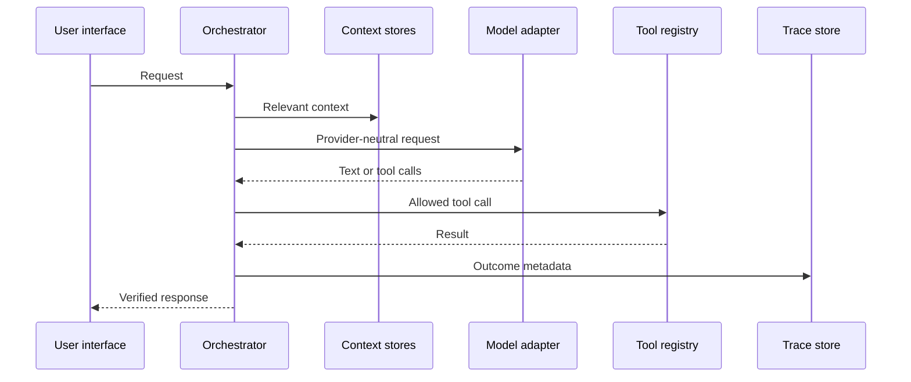

# Data flow and tracing

Every run records trace ID, source, agent, model, provider, tools, data stores
accessed, transformations, destinations, status, safe result summary, error
type, timestamps, and duration. Traces exclude authorization headers, request
bodies, provider thinking blocks, and secret values.

For an explicit content envelope, validation precedes context retrieval and
model selection. The trace records ordered input/output modalities,
content-derived identifiers, processing stage, safe transformations, storage
destinations, and bounded execution metadata containing only type, media type,
byte size, and digest. Raw text, base64, decoded binary data, and caller
metadata are never copied into the trace. Unsupported modality failures record
the attempted adapter identity and fail before any provider request.

Scheduled work follows the same orchestrator path after an automation record is
atomically claimed. Its trace source is `automation`; run status, attempts,
trace ID, and bounded result summary are stored separately in the automation
database. Daily and weekly records are rescheduled only after the run is
recorded.

The supervised path is lock → stale-claim recovery record → service heartbeat
→ expiring tokenized claim → normal orchestrator run → token-fenced finish.
SIGTERM sets a signal-safe drain event and prevents another cycle; terminal
state is persisted after the active bounded operation returns. If forced
termination occurs, a later instance records lease recovery before retrying;
the old token can no longer commit.

Proactive evaluation is active-memory metadata → category-specific schema
validation → deterministic evidence calculation → severity ordering → bounded
alert response. Memory free text is neither inspected nor copied. Conditional
automations apply exact alert/category/key filters and a validated cooldown,
then enter the same tokenized claim and orchestrator path as scheduled work.
Alerts are computed views, not a second persistent knowledge or memory store.
Schedule evaluation joins only validated task/exam/project intervals within a
bounded record count and horizon; pair evidence contains no record values.
Research revision evaluation is explicit observation → UTF-8 SHA-256 digest in
the knowledge environment → bounded same-key comparison → safe source-ID/time
evidence. The digest, URI, title, and source content never enter proactive
responses. External fetching is outside this flow in the current release.

Dashboard notification delivery is validated action → bounded notification
record → API/dashboard display → explicit read state. Automation-origin
delivery adds a linked trace containing only channel, severity, notification
ID, transformation, and storage destination. Title and body stay in the
notification data store and are not copied into trace or run-summary fields.

Generated-agent installation follows approval → manifest validation → SQLite
persistence → in-process registry load. Application scaffolding follows
approval → name/path/size validation → confined file writes → SHA-256 build
record. Neither path stores a secret or executes an arbitrary command.

AI-system draft conversion follows provider-disclosure approval → bounded
natural-language input → isolated no-context/no-tool Application Builder call
through the common model router → exact duplicate-free JSON parse → full
registry-backed Blueprint validation → content-free evidence and trace linkage.
The draft store contains no prompt or generated JSON, and the trace summary is
generic. A valid draft is returned for review but does not materialize files.

AI-system implementation planning follows exact requirements → complete
Blueprint revalidation → provider-identity-free architecture inputs → bounded
unique proposed paths → ordered work/evaluation/release gates → non-mutating
review output. A separate approval can write only the canonical plan manifest
to the bounded application workspace. Evidence retains digests, byte count,
status, workspace link, timestamps, and safe error type; proposed source and
test files are not generated or executed.

Source-candidate generation follows revalidated requirement → reviewed
implementation plan → separate provider disclosure → disclosure approval →
isolated no-context/no-tool model call → exact plan-bound JSON → isolated
candidate workspace → explicit human review → non-executing static checks →
separate candidate approval. Trace metadata records identifiers, provider/model
labels, lifecycle stages, and false runtime/deployment flags; it excludes
requirements, source, review notes, credentials, and model output. No lifecycle
step calls the external worker, runs candidate code, or promotes files.

Candidate runtime evaluation follows approved candidate → validated contract →
evaluator-owned bundle → signed external-worker request → authenticated bounded
response → execution observation → criteria result → content-free evidence and
trace. A signed sandbox claim is not executable isolation evidence. No result
path promotes, packages, publishes, or deploys candidate source.

Artifact packaging follows approval → confined workspace selection → stable
no-follow regular-file reads → portable path and size checks → per-file/source
digests → deterministic ZIP and embedded manifest → immutable target integrity
check → package record. Deployment reporting is a separate approval-gated
append-only record; it never invokes a target and always remains unverified.

Workspace verification follows approval → project/path/type/size validation →
non-executing parser/compiler check → bounded result → persistent verification
record. The Node syntax checker receives a minimal environment with no provider
credentials and cannot select an arbitrary executable or argument list.

Workspace test execution follows explicit runtime opt-in → per-run approval →
strict parent-environment allowlist → complete workspace/symlink/size scan → trusted child
runner → fixed unittest discovery → POSIX resources and wall timeout → redacted,
bounded persistent result. No user/model field becomes a command or argument.
The worker reports that filesystem/network isolation is absent and refuses
non-allowlisted parent environments; production hostile-code execution still
requires a separately deployed hardened container worker.

External worker submission follows operator approval → enabled/configured
check → secret-key resolution → confined workspace scan → hidden/sensitive/
binary/symlink/size/key-value rejection → canonical bounded source payload →
timestamped HMAC HTTPS request → bounded response read → HMAC/freshness/job/
schema/status verification → output redaction → result record. The signing key,
endpoint, and submitted bundle are not persisted. Sandbox fields are stored as
claims; isolation remains unverified until separate deployment evidence exists.

At the separate worker, TLS termination → bounded body read → HMAC/freshness
validation → exact schema/path/digest validation → job-ID/request-digest claim
→ isolation readiness check → ephemeral materialization → fixed unittest
runner → bounded/redacted output → signed response → replay record. The worker
has no model, agent, general shell, dependency installer, application database,
or provider credential. Its health output contains configuration booleans and
safe failure types, never the endpoint, key, source, or state path.

Every `/api/` request first consumes a bounded in-memory per-client quota, then
passes exact-origin validation and, when enabled, bearer or browser-session
authentication before its body is read or any application state is accessed.
Token values come from the secrets resolver, are compared in constant time, and
are never placed in status, traces, or logs. The login route exchanges a valid
bearer credential for a host-only HttpOnly cookie; the raw session ID is sent
only in `Set-Cookie`, hashed in process memory, and never persisted. A separate
CSRF token is returned only to the authenticated same-origin page and is
required on every cookie-authenticated mutation. OPTIONS preflight is rate- and
origin-gated but does not require the browser to transmit a credential.

Before response headers are sent, one query-free audit record is written with
method, route path, status, coarse outcome, duration, and timestamp. The audit
boundary deliberately has no fields for client identity, origin, headers,
query values, bodies, or credentials. An audit write failure cannot interrupt
the response path. Unknown API paths are stored and logged only as
`/api/[unknown]`.
