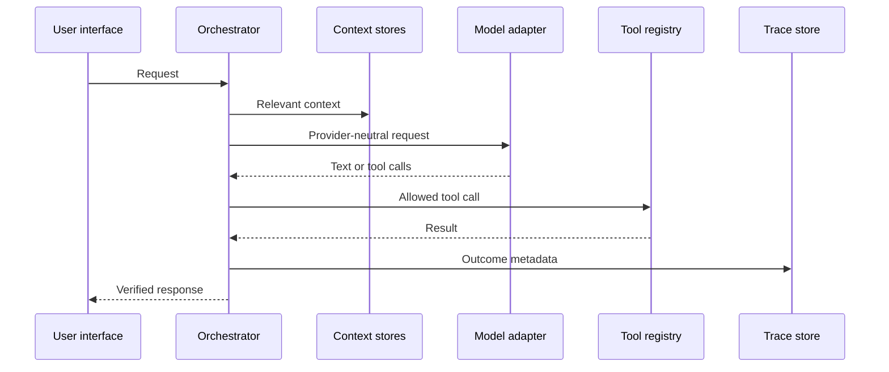

# Data flow and tracing

Every run records trace ID, source, agent, model, provider, tools, data stores
accessed, transformations, destinations, status, safe result summary, error
type, timestamps, and duration. Traces exclude authorization headers, request
bodies, provider thinking blocks, and secret values.
