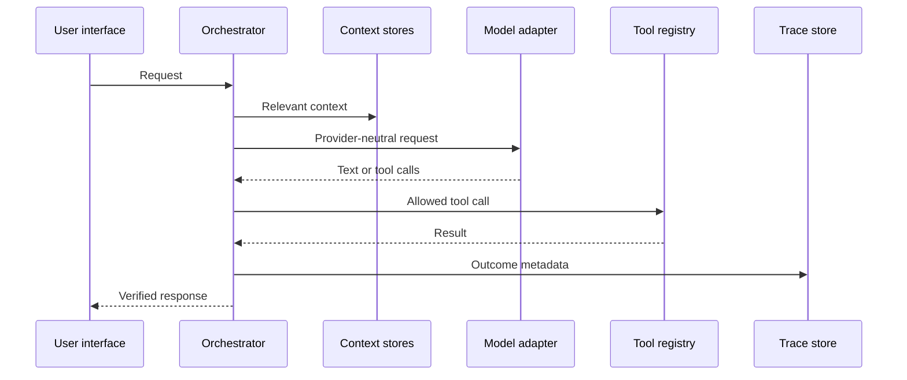

# Data flow and tracing

Every run records trace ID, source, agent, model, provider, tools, data stores
accessed, transformations, destinations, status, safe result summary, error
type, timestamps, and duration. Traces exclude authorization headers, request
bodies, provider thinking blocks, and secret values.

Scheduled work follows the same orchestrator path after an automation record is
atomically claimed. Its trace source is `automation`; run status, attempts,
trace ID, and bounded result summary are stored separately in the automation
database. Daily and weekly records are rescheduled only after the run is
recorded.

Generated-agent installation follows approval → manifest validation → SQLite
persistence → in-process registry load. Application scaffolding follows
approval → name/path/size validation → confined file writes → SHA-256 build
record. Neither path stores a secret or executes an arbitrary command.

Workspace verification follows approval → project/path/type/size validation →
non-executing parser/compiler check → bounded result → persistent verification
record. The Node syntax checker receives a minimal environment with no provider
credentials and cannot select an arbitrary executable or argument list.
